# 🤖 Agentic AI Support Ticket Agent (C# / .NET 8)


Autonomous support triage: classify inbound text, create Jira tickets, persist to SQLite, and send confirmations.
Backed by **Azure OpenAI** for reasoning + **EF Core** for state.

<!-- CI / CD Status -->
[](https://github.com/nexaddo/agentic-ai-csharp/actions/workflows/ci-cd.yml)


## Run (local)

```bash
# 0) prerequisites
dotnet --version  # 8.x

# 1) restore & build
dotnet restore
dotnet build

# 2) set config in src/WebApi/appsettings.json (Azure OpenAI + Jira)
# 3) run
dotnet run --project src/WebApi/WebApi.csproj
```

## 🔌 Quick Access (kubectl port-forward)

### Staging (shared namespace)
```bash
# if using the overlay's default namespace
kubectl -n ai-support-staging port-forward deploy/stag-support-agent 8080:5000
# Now hit it locally:
curl http://localhost:8080/healthz
curl -X POST http://localhost:8080/api/agent/act \
  -H "Content-Type: application/json" \
  -d '{"requesterEmail":"alex@example.com","message":"Export to CSV fails with 500."}'
```

### ⚙️ Podman vs Kubernetes (with Make)

```bash
# --- Podman ---
make podman-run        # build + run container
make podman-up         # deploy as a Pod (play kube)
make podman-down       # stop/remove
make podman-logs       # tail logs
make podman-shell      # enter container shell

# --- Kubernetes ---
make k8s-up-staging    # apply staging overlay
make k8s-down-staging  # remove staging overlay
make k8s-up-prod       # apply prod overlay
make k8s-down-prod     # remove prod overlay
make k8s-status        # show pods in staging + prod
```

## Tests
### 🧰 Local CI (same as the pipeline)

```bash
# restore + build + test (outputs TRX to ./TestResults)
make ci

# view or clean results
make ci-results
make ci-clean
```

### 🔐 Install Secrets Store CSI Driver (kustomize-native)

```bash
# one command, no Helm CLI required:
kubectl apply -k deploy/secrets-store

# verify
kubectl -n kube-system get pods -l app=secrets-store-csi-driver
kubectl -n kube-system get pods -l app=csi-secrets-store-provider-azure
```

### Flow Diagram

```mermaid
flowchart LR
  subgraph Dev["Developer"]
    A[Commit / Tag]
  end

  subgraph GitHub["GitHub Actions"]
    B[Build & Test]
    C[Build & Push Image → GHCR]
    D{Branch/Tag?}
    E[Deploy Staging]
    F[[Manual Approval<br/>Environment: production]]
    G[Deploy Production]
  end

  subgraph K8s["Kubernetes Cluster"]
    S[(Staging NS: ai-support-staging)]
    P[(Prod NS: ai-support-prod)]
  end

  A --> B --> C --> D
  D -- main / tag --> E --> S
  E --> F --> G --> P
  D -- feature/* / develop --> E
```

